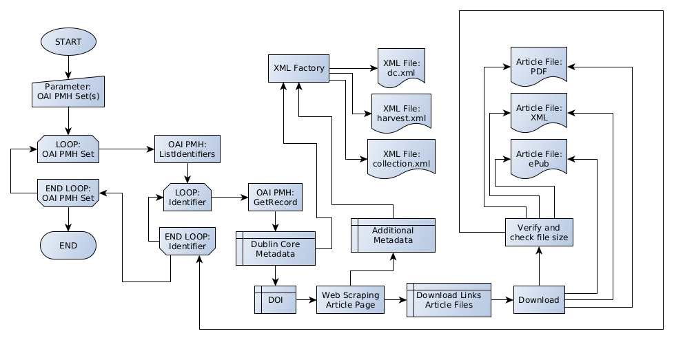

The code in this repo is a public snapshot. Although the development happens currently in our internal git repo, we are very open for feedback here on GitHub.

This project is a prototype from the digital archiving team at the TIB (German National Library of Science and Technology). It is a downloading tool for open access journal articles from a singular publisher (Hindawi Limited). The Publisher is not involved in this project. Our basic idea was to actually retrieve a large quantity of articles in a semi-automated way and put them in our archive – while learning from the experience.  
Please keep in mind we were focusing on details and implementing ad hoc solutions whenever a problem would come up. We do not consider our code to be reusable outside of our specific workflow. As always when web scraping is involved things are likely to break over time. 
While the readme is only available in German there are English docstrings and comments in the code itself.

# Downloader für Hindawi Journals

_(Codename: HinJoDL Classic)_

Python-Skript zur Abholung von Hindawi-Journals. Produktiver Prototyp.
 
Der Journal-Downloader nutzt die von Hindawi bereitgestellte OAI-PMH-Schnittstelle. Als Input wird ein OIA-PMH-Set (oder mehrere) angegeben.

Die an der Schnittstelle exponierten Sets entsprechen einzelnen Zeitschriften oder Jahrgängen. Aus einer _ListIdentifiers_-Abfrage extrahiert das Skript die zugehörigen OAI-Identifier und iteriert anschließend über diese. Jeder Identifier gehört zu einem OAI-Record (entspricht einem Artikel/DOI). Über den zugehörigen DOI wird die Artikelseite abgerufen, alle Download-Links werden extrahiert und die zugehörigen Dateien heruntergeladen und mit Matadaten aus dem OAI-Record abgelegt.

## Anwendung

### Input

Das Skript erwartet mindestens ein gültiges Hindawi-Set als Parameter.

Beispiel:

    python3 hindawi-downloader.py HINDAWI.IJMMS:2016

Die Sets von Hindawi folgen in der Regel dem Schema

    HINDAWI.<ZEITSCHRIFTENKÜRZEL>:<JAHRGANG>
    
Entsprechend der OAI-PMH-Spezifikation dient der Doppelpunkt als Trennzeichen für ein untergeordnetes Set. Die Bezeichnung vor dem Doppelpunkt ist ebenfalls valide und enthält die komplette Zeitschrift. In einzelfällen weichen Subsets von der Konvention ab und enthalten Artikel aus mehreren Jahren. Die Angabe _JAHRGANG_ wurde in vielen Fällen von einer ein- bis zweistelligen Nummer auf Jahreszahlen umgestellt. Vermutlich werden damit "Volumes" bezeichnet, die nicht immer identisch mit einem Jahrgang sind. Issues werden in OAI-Records nicht erfasst und daher vom Downloader nicht abgebildet. 

Als Ausgangspunkt können die Namen der Sets mit _listsets_ (2.) bei Hindawi abgefragt werden:  
[https://www.hindawi.com/oai-pmh/](https://www.hindawi.com/oai-pmh/)

Mehrere Sets als Input müssen per Textdatei übergeben werden:

    python3 hindawi-downloader.py my_set_file.txt

Es handelt sich dabei um eine einfache Liste mit gültigen Set-Bezeichnungen. Das erforderliches Format: Ein Set pro Zeile, kein weiterer Inhalt.

Mit der Funktion `--makesetfile` kann eine solche Liste mit Subsets (Jahrgänge) generiert werden. Dabei wird ein gültiges Set (Zeitschrift) angegeben.

    python3 hindawi-downloader.py HINDAWI.ACE:2009 --makesetfile my_ace_sets.txt

Auch hier ist es möglich, anstelle des Sets eine Textdatei mit mehreren Sets anzugeben. Auf diese Weise lassen sich umfangreiche Listen erstellen, die dann manuell nach Bedarf angepasst werden können.
Die Funktion basiert auf einer _ListSets_-Abfrage.

Die skriptseitige Auswertung der übergebenen Sets ist nur begrenzt intelligent. Strings, die formal gesehen kein Hindawi-Set sind, werden verworfen. Es kann zwischen Set und Subset unterschieden werden. Eine Prüfung auf Dubletten findet allerdings nicht statt. 
Dies könnte insbesondere dann vorkommen, wenn ein Setfile sowohl das Set als auch die Subsets enthält.
 
 In diesem Fall würde das Skript

- einen Ordner für das Set (komplette Zeitschrift) erstellen
    - darin pro Artikel einen Unterordner anlegen
    - die Artikeldateien herunterladen   U N D
- einen Ordner für jedes Subset (jeden Jahrgang) erstellen
    - darin Unterordner anlegen
    - die selben Artikeldateien erneut herunterladen

Es liegt also in der Verantwortung des Users, keine wiederholten Download-Anfragen an Hindawi zu triggern.

#### Übersicht der Optionen

* `--countrecords`: Erweitert die im auch im Normalbetrieb aktive Zählung von OAI Records, deaktiviert aber den Download. Die in einem Set enthaltenen OAI Records werden gezählt und in einer Übersicht als CSV exportiert (`<timestamp>_counted_records.csv`). Mit der Option werden automatisch bei der Angabe von Sets (Journals) die jeweiligen Subsets (Volumes) ermittelt und gezählt. 
* `--makesetfile <Dateiname.txt>`: Für ein Journal (oder mehrere Journals) werden die zugehörigen Subsets (Volumes) ermittelt und in <Dateiname.txt> sukzessive ergänzt.
* `--oaiid "<identifier>"`: Gezielter Download anhand von OAI-Identifiern. Benötigt dennoch die Angabe eines Sets. Die Funktion überspringt die ListIdentifiers-Abfrage des Skripts und verwendet stattdessen den hier übergebenen Input. Es können mehrere Identifier übergeben werden, getrennt durch Leerzeichen.  
Alternativ ist es möglich eine Textdatei zu übergeben, die eine Liste von OAI-Identifiern enthält. Der Downloader erstellt zur Laufzeit eine Liste der zu bearbeitenden Identifier und schreibt die noch nicht heruntergeladenen in eine Datei (`<timestamp>__remaining_OAI_record_ids.txt`). Tritt bei der Verarbeitung eines großen Sets (tausende IDs) eine Exception auf, lässt sich das Set so ohne erneuten Komplett-Download vervollständigen.  
 __Achtung:__ Gehören die OAI-IDs nicht zum angegebenen Set, werden ohne Fehlermeldung falsche Metadaten generiert.
* `--urllut <lookuptable.json>`: Übergabe einer JSON-Datei, die ein einfaches Mapping von DOI (in URL-Form) und URL (Artikelwebseite bei Hindawi) enthält. So lassen sich DOIs "überbrücken", deren Download zuvor gescheitert ist, da sie auf Drittquellen verweisen. 
* `--loglevel <level>`: Setzt den Level für das Logfile (DEBUG, INFO, WARNING, ERROR, CRITICAL), Default ist INFO. Mit DEBUG werden auch die Anfragen an den Server erfasst.
* `--help`: Kurzanleitung.

Die Parameter `--countrecords` und `--makesetfile` dienen der Analyse und Vorbereitung, daher deaktivieren sie die Download-Funktion.

Das Skript _generate_urllut.py_ ergänzt die Funktion `-urllut`. Bei Jahrgangsweise betroffenen Artikeln können damit größere JSON-Dateien mit dem erforderlichen DOI-zu-URL-Mapping generiert werden. Die Daten werden von der Hindawi-Webseite ausgelesen. 

### Output

Die "Nutzdaten", also heruntergeladene Artikeldateien sowie die zugehörigen Metadaten werden in einem konfigurierbaren Ordner gespeichert. Der Pfad kann in der Datei `download_to.cfg` angepasst werden. Es ist sinnvoll diesen Pfad mit dem jeweiligen Zeitschriftenkürzel enden zu lassen. Die unten dargestellte Struktur wird darin angelegt, sodass bei der Arbeit mit jahrgangsbasierten Sets die Jahrgangsordner in einem Ordner für die komplette Zeitschrift liegen.  
Logfiles und ähnliches werden in dem Ordner abgelegt, von dem aus das Skript ausgeführt wird. 

In bezug auf den Download unterscheidet das Skript nicht zwischen Set oder Subset. Es erstellt einen Ordner für das übergebene Set und legt darin für jeden Artikel einen Unterordner an. Die Entscheidung über Sets (Journal) oder Subsets (Jahrgänge) als Input bestimmt die resultierende Ordnerstruktur: entweder liegen alle Artikelordner in einem gemeinsamen Ordner für die gesamte Zeitschrift oder man erhält mehrere, jahrgangsweise befüllte Ordner. In den Unterordnern werden alle auf der Artikelseite befindlichen Downloads abgelegt.

Die Ordnernamen für den Output werden aus dem jeweiligen Identifier des OAI-Records abgeleitet. Hierbei werden Punkte, Doppelpunkte durch Unterstriche ersetzt.

Aus

    oai:hindawi.com:10.1155/2011/391971

wird

    10_1155_2011_391971

In der Regel sollte der numerische Teil dem DOI des Artikels entsprechen. Wenn dies nicht zutrifft (ältere Jahrgänge), hat es keine weiteren Auswirkungen (DOI für den Download wird aus dem _dc.identifier_-Element des OAI-Records ausgelesen).

#### Ordnerstruktur

Die Inhalte des Hindawi-Bestands sind in bezug auf die zu einem Artikel geörenden Dateien nicht einheitlich. Für aktuelle Artikel gibt es üblicherweise vier Repräsentationen (HTML, PDF, XML, ePub). Die HTML-Seite wird als Repräsentation ignoriert, da dynamische Inhalte per Download nicht ohne weiteres abbildbar sind. Ältere Artikel sind oft Digitalisate, die nur als PDF vorliegen. Gegebenfalls finden sich _supplementary materials_ dabei, die jeden Dateityp beinhalten können.

Der Downloader produziert folgende Dateihierarchie (in Klammern: erwartete Anzahl der Dateien/Ordner):  

~~~
<Set-Name>_<Timestamp>           .      .       .       .     (1)
          |---<oai_id_A>                .       .       .     (1)
          |     |---oai-record.xml      .       .       .     (1)
          |     |---dc.xml              .       .       .     (1)
          |     |---harvest.xml         .       .       .     (1)
          |     |---collection.xml      .       .       .     (1)
          |     |---MASTER                      .       .     (1)
          |     |     |---<article-no>.pdf      .       .     (1)
          |     |     |---<article-no>.xml      .       .     (0-1)
          |     |     |---<article-no>.epub     .       .     (0-1)
          |     |     |---supplements                   .     (0-1)
          |     |     |     |---<article-no>.f1.pdf     .     (0-1)
          |     |     |     |---<article-no>.f2.docx    .     (0-1)
          |     |     |     |---<article-no>.f<n>.<ext> .     (0-n)
          |---<oai_id_B>
          |     |---oai-record.xml
          |     |--- ...
          |---<oai_id ...>
~~~

Der Name des übergeordneten Set-Ordners enthält eine _Timestamp_-Komponente, die den Zeitpunkt des Skriptstarts enthält. Bei wiederholter Anwendung mit gleichem Input werden also neue Ordner erstellt.

Außer den Artikeldateien werden XMLs mit Metadaten generiert, die spezifisch für den weiteren Workflow an der TIB sind (CSV-Ingest). Die `dc.xml` enthält Dublin Core Metadaten, die teils über den OAI Record hinaus gehen. Die harvest.xml liefert _provenance_ Metadaten. Die `collection.xml` dient der Bildung von Collections im Langzeitarchivierungssystem. 

Logs und Reports:

* `<Timestamp>_hindownload.log`  
    Das Logfile protokolliert den Programmdurchlauf und enthält etwas mehr Information als die parallel laufende Bildschirmausgabe.
* `<Timestamp>_counted_records.csv`  
    Listet die Anzahl der per OAI PMH abgefragten Records pro Set auf.
* `<Timestamp>_missing_metadata.txt`  
    Wenn obligatorische Metadaten in den OAI-Records fehlen, werden die zugehörigen Identifier gesammelt und mit Titel in diese Textdatei geschrieben. In der Regel fehlt dc:creator (Autor) und der Titel gibt Aufschluss darüber, ob es sich um einen Fehler handelt (wiss. Artikel) oder kein Handlungsbedarf besteht (Editorial, Kalender, etc.) Zweck ist die Vereinfachung der Dokumentation in Jira-Tickets.
* `<Timestamp_failed_downloads.txt`  
    Liste von Sets und OAI-Identifiern, deren Artikeldownload trotz Retries gescheitert ist. In den meisten Fällen sind vorübergehende Serverfehler die Ursache. Mit der Option `--oaiid` lassen sie sich gezielt nachholen. 

## Helper-Skripte

Neben dem Journal-Downloader gibt es noch weitere Skripte für separate Teilaufgaben.

* `count_article_pages.py`  
    Zählt die Anzahl der Artikel pro Jahrgang einer gegebenen Zeitschrift unter Verwendung der Hindawi-Webseite als Quelle. Damit ist zur Vollständigkeitskontrolle eine weitere Quelle neben der OAI-PMH-Abfrage erschlossen. Input: Zeitschriftenkürzel und Jahrgänge müssen per Hand in das Skript eingetragen werden. Output: Tabelle als CSV-Datei.
* `generate_urllut.py`  
    Generiert einen URL-Lookup-Table. Gelegentlich führen DOIs von Zeitschriften, die von anderen Publishern übernommen wurden noch zu der alten Quelle. Falls ganze Jahrgänge betroffen sind, kann dieses Skript per Webscraping eine JSON-Datei erstellen, die die Zuordnung von DOI und Hindawi-URL enthält.
* `count_sips_snd_files.sh`  
    Shell-Skript, das vorhandene Dateien und Ordner zählt, sowie einige Metadaten aus XML-Dateien ausliest. Dies dient u. a. der Vollständigkeitskontrolle. Desweiteren lassen sich so Unregelmäßigkeiten finden: Gab es Änderungen beim Titel der Zeitschrift? Entsprechen die Sets tatsächlich einem Jahrgang?
* `file_size_checker.py`  
    Eigenständige Variante der Dateigrößenüberprüfung des Downloaders. Dessen Output lässt sich damit auf leere Dateien und verdächtige Dateigrößen (zu groß, zu klein) überprüfen. Ein Bug führte dazu, dass am Anfang der Abholung alle Unterordner mit Anhängen zu den Artikeln nicht überprüft wurden. Daher musste dies extern nachgeholt werden.
* `progress_metrics.sh` und `progress_metrics_files.sh`  
    Workflow-spezifische Skripte, die Dateien oder SIPs zählen. Die Inhalte werden nach Bearbeitungsstatus in verschiedene Ordner verschoben; die Skripte ermitteln das Verhältnis von bearbeiteten zu unbearbeiteten SIPs.

## Voraussetzungen

Für das Harvesting der OAI-PMH-Schnittstelle muss das Python-Modul _Sickle_ vorhanden sein. Die Auswertung von HTML-Seiten erfolgt mit _Beautiful Soup_. Test und Entwicklung unter Ubuntu 20.04 mit Python 3.8.2. Verwendet f-strings (min. Python 3.6).

Das Skript benötigt eine aktuelle Python-Version als Interpreter und einige externe Module, die gesondert installiert werden müssen. Mit der Einrichtung eines _virtual environment_ können externe Module inklusive ihrer Abhängigkeiten installiert werden, ohne die systemweite Python-Instanz zu verändern.

Als Teil der Metadaten wird ein Versionsstring generiert, der den genauen Zeitpunkt des letzten git-Commits enthält. Da `git log` zur Abfrage verwendet wird, muss _git_ auf dem ausführenden Rechner vorhanden sein. Änderungen am Skript auf dem ausführenden System (ohne anschließenden Commit und Push) sind zu vermeiden, da hierdurch die Versionierung ausgehebelt würde.

Zunächst wird das git-Repo geklont. Im lokalen Projektordner erstellt man danach das virtual environment (gilt für Ubuntu) mit

    python3 -m venv venv

Anschließend aktiviert man das virtual environment mit

    source venv/bin/activate

und installiert die externen Module Sickle und Beautiful Soup. Dafür benutzt man den Paketmanager _pip_. Es gibt zwei Wege: Die erste Methode geht über die `requirements.txt`, in der die notwendigen Pakate inklusive ihrer Version vermerkt sind:

    pip3 install -r requirements.txt

Die zweite Methode besteht in der manuellen Installation der Pakete:

    pip3 install Sickle
    pip3 install beautifulsoup4

Auch hier werden Abhängigkeiten (wie z.B. lxml) automatisch berücksichtigt, im Unterschied zur ersten Methode werden die jeweils aktuellen Versionen geholt.

## Details zum Programmablauf

### Vereinfachtes Flussdiagramm

### Quellen für Metadaten

Für ein übergebenes Set stellt das Skript eine _ListIdentifiers_-Anfrage an die OAI-PMH-Schnittstelle von Hindawi. Aus der Antwort wird eine Liste der OAI-Identifier generiert, über die anschließend iteriert wird. In jeder Iteration wird mittels des _GetRecord_-Verbs der zum Identifier gehörende OAI-Record heruntergeladen. In dessen Header finden sich Informationen zum Record selbst, in seinem Metadatenteil hingegen Dublin-Core-Metadaten, die den Artikel beschreiben. Die meisten DC-Elemente werden unverändert in die _dc.xml_ gemappt.

Das Feld _dc:identifier_ enthält den DOI. Dieser dient als Ausgangspunkt, um die Artikelwebseite abzurufen. Dort werden per Web-Scraping weitere Informationen ausgelesen.

Dies passiert zum Beispiel bei einigen Metadaten, die im OAI-Record fehlen. Die ISSN und die genaue Variante der CC-Lizenz werden auf diese Weise erfasst und ebenfalls in die _dc.xml_ geschrieben.

### Quellen für heruntergeladene Dateien

Für das Herunterladen der Artikeldateien wird die Artikelseite nach entsprechenden Links durchsucht, wobei davon ausgegangen wird, dass die URL aller Downloadlinks den String "downloads.hindawi.com" enthält. Es wird eine dublettenfreie Liste generiert, die Dateien heruntergeladen.
Eine einfache Heuristik überprüft hierbei die Dateinamen. Das Namensschema bei Hindawi scheint sehr stabil zu sein: Artikeldateien setzen sich aus Artikelnummer und Extension zusammen. Zusätzliche Dateien folgen dem Schema `<Artikelnummer>.f<n>.<ext>`, wobei _n_ eine einfache Nummerierung der Zusätze darstellt. Das Skript erkennt solche Zusätze und legt sie im bedarfweise erstellten Unterordner _supplements_ ab.
Zugleich werden MD5-Prüfsummen direkt aus den noch im RAM befindlichen Bytestreams der Dateien generiert. 

### Mechanismen zur Überprüfung

Nach erfolgtem Download werden die HTTP-Status-Codes ausgewertet. Eindeutige Fehler (404, 503, etc.) werden im Logfile vermerkt. Am Ende des Logfiles (und der Bildschirmausgabe) gibt es einen expliziten Hinweis, falls die Warnstufen WARNING oder ERROR erreicht wurden.

Da der Downloadmechanismus agnostisch gegenüber Dateitypen und -größe ist, finden nach dem Download weitere Checks statt. Es werden leere Dateien und verdächtig kleine Dateien (unter 1 kB) geloggt, ebenso sehr große Dateien (über 2 GB). Darüber hinaus werden die Dateinamen überprüft. Wenn kein Dateiname dem erwarteten Schema für Artikel-PDFs entspricht, führt dies zu einer Fehlermeldung.

## Lizenz

Dieses Projekt steht unter der [Apache 2.0 License](LICENSE).
